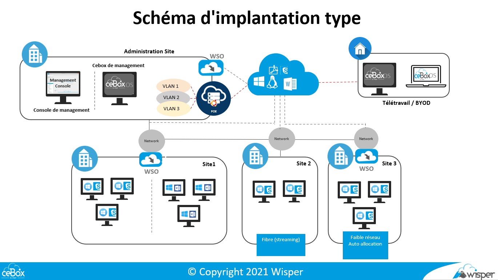
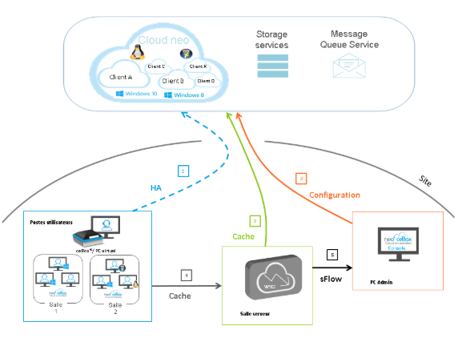

***********************
Documentation technique
***********************

ceBox®
******

----

CeBox® est une solution de gestion de parc qui intégre de la virtualisation de poste de travail en Mode VDe (Virtual Desktop Efficace, Evolutive, Economique et co-friendly).

Ce produit vous permet de déployer facilement un environnement de travaille à vos collaborateurs sans infrastructure serveur.

Le système d’exploitation ceBox® OS peut s’installer sur l'ensemble des poste de travail que vous avez sur votre parc en fonction de prés requis matériel. 

Afin de vous familiariser avec la solution ceBox®, vous trouverez ci-dessous une description précise des différents composants de la solution en mode LAN et ceBox® télétravail.

**Système d’exploitation ceBox®**
*********************************

ceBoxOS® est une distribution Linux compilée par nos équipes R&D afin d’obtenir un système 
d’exploitation optimisé et sécurisé transformant votre machine en hyperviseur local :

» Fonctionnalités Clés :
✓ Gestion du Hardware en mode intégré
✓ Intègre la gestion d’un réseau tunnelisé
✓ Intègre une gestion de disque virtuel streaming cloud
✓ Gère des authentifications, des configurations.
✓ Gère un hyperviseur pour lancer des machines virtuelles.

» Sécurité des services et du réseau :
✓ Pare-feu Linux Netfilter intégré, peut être personnalisé 
✓ Service d'écoute seulement sur l'interface privée du tunnel
✓ Tous les flux réseaux sont encapsulés dans le tunnel sécurisé, géré au sein du 
kernel linux

**Wisper cloud**
****************

Le cloud privé Wisper est utilisé pour stocker les masters (OS et applications) ainsi que leurs versions précédentes. 

Les données client ne sont en aucun cas stockées dans le cloud privé de Wisper.

**Le réseau ceBox®**
********************

La configuration réseau doit permettre l'échange de flux entre les différents composants de la ceBox®. C'est une condition préalable à l'exploitation.
La matrice des flux UDP TCP ci-dessous présente les ouvertures nécessaires au bon fonctionnement du produit.

**Flux**
********

Voir la documentation Matrice de flux ceBox®

NB : Il est recommandé d'avoir une liaison symétrique de 10 Mbits/s entre le WSO® du site principal et le Cloud Wisper.

**Fonctionnalité de tunnelisation**

La solution Wisper intègre un système VPN “tout en un” sécurisé et maîtrisé.
Par défaut, chaque ceBox® intègre un système de tunneling chiffré entre les ceBox®, le WSO® et le Cloud.
 
 
**Description du mécanisme de tunnelisation :**

Ce mécanisme s'applique à toutes les versions du produit : ceBox® LAN et ceBox® télétravail.
Nous utilisons ce mode de fonctionnement pour trois raisons :

  * Mise en place d’un processus d’échange de clés publiques entre WSO®, ceBox® et Cloud
  * Souplesse du déploiement des ceBox®: le WSO® accepte toujours les clés publiques ceBox®
  * Gain de temps et sécurisation Wisper du VPN: le process de construction d’un VPN client standard n’est plus utilisé (échange de clés, phases..).

Les protocoles de sécurité sont :
 
  * ChaCha20 pour le cryptage symétrique, authentification par ly1305, Conformément à la  RFC7539 dans l’AEAD construction.
  * Curve25519 pour ECDH
  * BLAKE2s pour le hashing et le keyed hashing, conformément à la RFC7693.
  * SipHash pour les hashtable keys
  * HKDF pour les key dérivation, conformément à la  RFC5869

